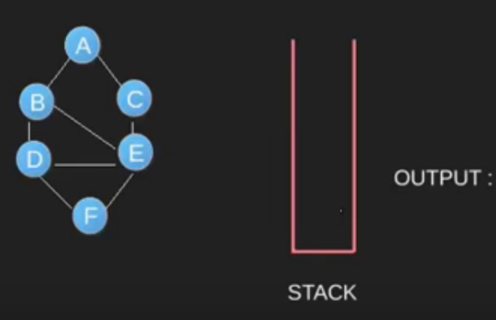
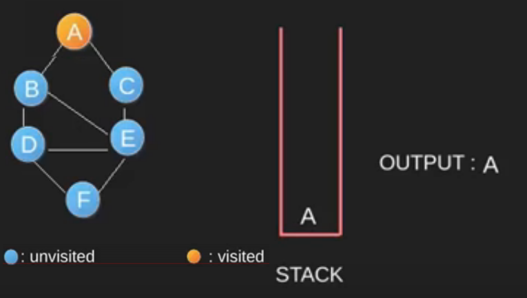
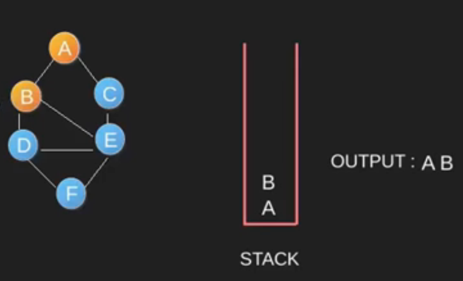
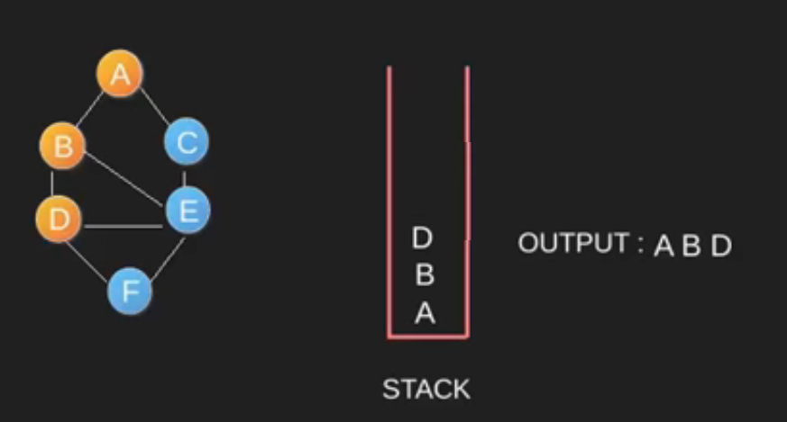
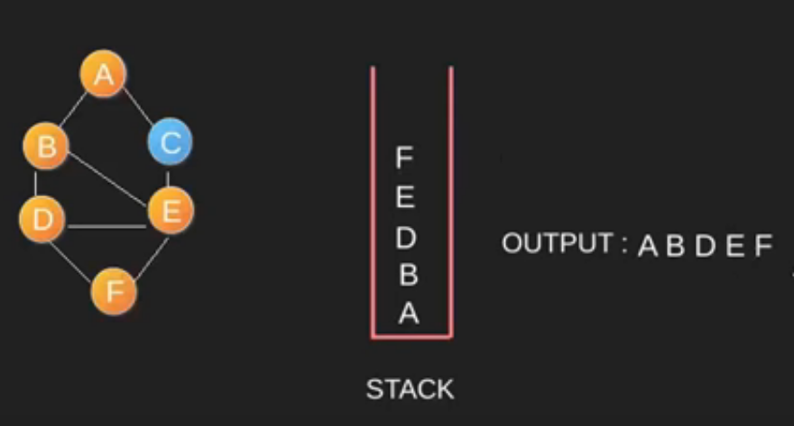
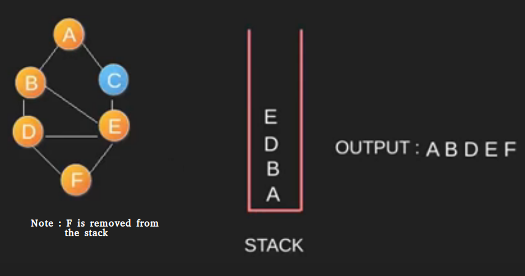
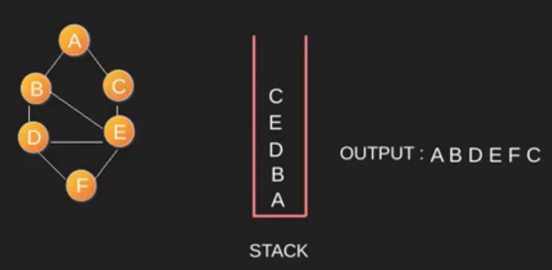
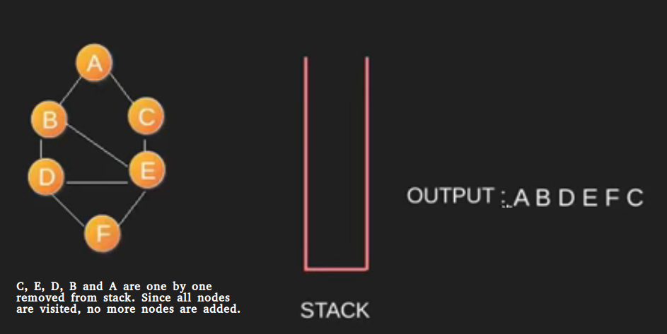
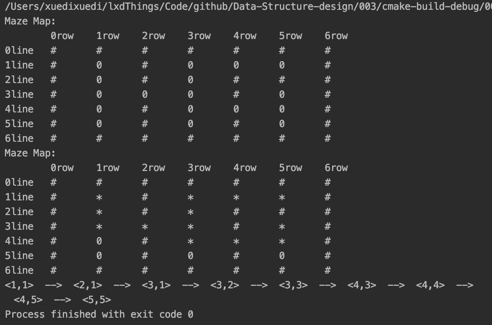
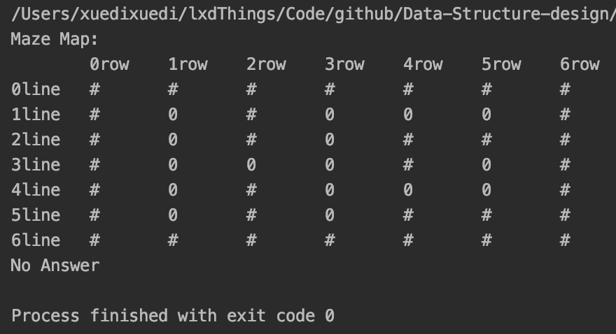

<h2 align="center">Project documentation</h2>
<h1 align="center">Data structure course design</h1>
<h2 align="right">——Brave Maze Game</h2>


<p align="right">
  Author name：<U>Xuedi Liu</U><br>
  Number：<U>1752985</U><br>
  instructor：<U>Ying Zhang</U><br>
  College/Major：<U>School of Software Engineering/Software Engineering</U><br>
</p>


<div STYLE="page-break-after:always;">
</div>

<div STYLE="page-break-after:always;">
</div>

[TOC]

- **Operating Environment**:
  - Unix executables: running on **Unix** platforms
  - Linux executables: running on **Linux** platforms
  - exe executable file: Windows Console Application, running on 64-bit Windows platform
- **Code hosting platform**: Github

<div STYLE="page-break-after:always;">
</div>

## 1. Analysis

### 1.1 Project background analysis

There are only two doors in the maze, one is called the entrance and the other is called the exit. A knight rides into the maze from the entrance. The maze sets many obstacles. The knight needs to find a way in the maze to reach the exit.

### 1.2 Project function requirements

The maze problem can be solved by using the retrospective method, that is, searching under certain constraint conditions to search forward, and if the progress is blocked, then go back in time to correct the wrong alternative path and continue searching. Start from the entrance and explore forward in a certain direction. If you can get through, that is, reach a certain point, then reach a new point, otherwise explore the next direction; if there is no access in all directions, return to the previous point along the original road. Change direction and continue testing until all possible paths are explored, or a path is found, or there is no way to go and return to the entry point. In the solution process, in order to ensure that when you cannot continue to walk forward after reaching a certain point, you can correctly return to the previous one so as to test forward from the next direction, you need to save the bottom of each point that can be reached during the test. Mark and the direction of the point, the trial process ends when the exit is found.

<div STYLE="page-break-after:always;">
</div>

## 2. Design

### 2.1 Data structure design

This question is a typical question for finding the path of a maze. We need to find a path from the beginning to the end. This type of problem is usually implemented by depth-first search or breadth-first search. Depth-first search preferentially searches for any successor to the currently found node, and then continues deep search. Breadth-first search searches for all successors of the current node and then searches for successors of each node. Because this question does not require finding the shortest path, we only need to find a path that can lead to the end point. So we use a depth-first search algorithm.

Depth First Traversal (or Search)for a graph is similar to Depth First Traversal of a tree. The only catch here is, unlike trees, graphs may contain cycles, so we may come to the same node again. To avoid processing a node more than once, we use a boolean visited array.

For example, in the following graph, we start traversal from vertex 2. When we come to vertex 0, we look for all adjacent vertices of it. 2 is also an adjacent vertex of 0. If we don’t mark visited vertices, then 2 will be processed again and it will become a non-terminating process. A Depth First Traversal of the following graph is 2, 0, 1, 3.


Depth-first search can be implemented through recursion and backtracking. The specific method is: For a given point, after obtaining an adjacent vertex, continue to search the vertex depth, and the guide cannot find the next point. Take a step back to find the next adjacent vertex and search.

Another method of non-recursive implementation is to use the data structure of the stack to achieve. The basic idea is: start from the first vertex of a given search, push it onto the stack, and mark it as visited; then loop through the following operations, as long as the stack is not empty, remove the top element and record it If necessary, it can be stored in an array), and then hit all adjacent vertices, as long as it has not been accessed, it is pushed onto the stack and marked as visited. When the element in the stack is 0, at the end of the algorithm, all visited points are marked and pushed into the stack. As long as the graph is connected, all points are output or recorded.

The specific method is as follows:

















### 2.2 Class structure design

A stack is a special container that stores data objects. The data elements are arranged in a linear logical order, so the first and last elements can also be defined. However, although the stack structure also supports the insertion and deletion of objects, the scope of its operations is limited to a specific end of the stack. That is to say, if it is agreed that a new element can only be inserted from one end, the existing element can only be deleted from this end. The other end of the prohibited operation is called the blind end.

As an abstract data type, the common operations required by the stack include pushing an element onto the stack, popping the element on the top of the stack, and returning the value of the element on the top of the stack. Stack implementation can be based on a one-way linked list: set up a sentinel head node, each time a push operation is equivalent to inserting a new node after the head node, and popping the node after the head node.


### 2.3 Member and operational design

#### 1. Point

```C++
struct Point {
    int x;
    int y;

    bool operator==(const Point &p) {
        return p.x == this->x && p.y == this->y;
    }

    Point() = default;

    Point(int x, int y);
};

```

**Operation：**

```c++
Point::Point(int x, int y) {
    this->x = x;
    this->y = y;
}

```

#### 2. Maze

**Private: **

```c++
private:
    int _size;

    int DIR[4][2] = {{0,  1},
                     {0,  -1},
                     {-1, 0},
                     {1,  0}};
```

**Public:**

```c++
public:
    char **_maze;
    char **_Bmaze;
    char **_ansMaze;
    Point _start;
    Point _end;

    Maze();

    void printMaze(char **maze);

    void changeMaze();

    Stack<Point> dfs(int x, int y);

    void displayPath(Stack<Point> s);
```

**Core function:**

Constructor:

```c++
Maze::Maze() {
    _size = 7;
    _maze = new char *[_size];
    _Bmaze = new char *[_size];
    _ansMaze = new char *[_size];
    for (int i = 0; i < _size; ++i) {
        _maze[i] = new char[_size];
        _Bmaze[i] = new char[_size];
        _ansMaze[i] = new char[_size];
    }
    strcpy(_maze[0], "#######");
    strcpy(_maze[1], "#0#000#");
    strcpy(_maze[2], "#0#0###");
    strcpy(_maze[3], "#000#0#");
    strcpy(_maze[4], "#0#000#");
    strcpy(_maze[5], "#0#0#0#");
    strcpy(_maze[6], "#######");
    strcpy(_Bmaze[0], "0000000");
    strcpy(_Bmaze[1], "0000000");
    strcpy(_Bmaze[2], "0000000");
    strcpy(_Bmaze[3], "0000000");
    strcpy(_Bmaze[4], "0000000");
    strcpy(_Bmaze[5], "0000000");
    strcpy(_Bmaze[6], "0000000");
    strcpy(_ansMaze[0], "#######");
    strcpy(_ansMaze[1], "#0#000#");
    strcpy(_ansMaze[2], "#0#0###");
    strcpy(_ansMaze[3], "#000#0#");
    strcpy(_ansMaze[4], "#0#000#");
    strcpy(_ansMaze[5], "#0#0#0#");
    strcpy(_ansMaze[6], "#######");
    _start.x = 1;
    _start.y = 1;
    _end.x = 5;
    _end.y = 5;
}
```

Display the maze:

```c++
void Maze::printMaze(char **maze) {
    cout << "Maze Map:" << endl;
    cout << "\t\t";
    for (int i = 0; i < _size; ++i) {
        cout << i << "row\t";
    }
    cout << endl;
    for (int i = 0; i < _size; ++i) {
        cout << i << "line\t";
        for (int j = 0; j < _size; ++j) {
            cout << maze[i][j] << "\t\t";
        }
        cout << '\n';
    }
}
```

Deep first search:

```c++
Stack<Point> Maze::dfs(int x, int y) {
    Stack<Point> s;//存放走过节点的栈
    Point p(x, y);//新建一个节点，作为下一个要走的节点
    _Bmaze[x][y] = '1';
    s.push(p);
    int i = 0;
    while (!s.empty()) {
        while (i < 4) {
            int nx = p.x + DIR[i][0];
            int ny = p.y + DIR[i][1];
            if (_maze[nx][ny] == '0' && _Bmaze[nx][ny] == '0') {
                p.x = nx;
                p.y = ny;
                s.push(p);
                if (nx == _end.x && ny == _end.y) {
                    return s;
                }
                _Bmaze[nx][ny] = '1';
                i = 0;
                continue;
            }
            ++i;
        }
        s.pop();
        if (s.empty()) {
            cout << "No Answer" << endl;
        } else {
            p = Point(s.top().x, s.top().y);
            i = 0;
        }
    }
}
```

Output the path you find:

```c++
void Maze::displayPath(Stack<Point> s) {
    Stack<Point> st;
    while (!s.empty()) {
        st.push(s.top());
        s.pop();
    }
    while (!st.empty()) {
        cout << '<' << st.top().x << ',' << st.top().y << '>';
        if (st.size() > 1) {
            cout << "  -->  ";
        }
        st.pop();
    }
}
```

Generate result path:

```c++
void Maze::changeMaze() {
    for (int i = 0; i < _size; ++i) {
        for (int j = 0; j < _size; ++j) {
            if (_Bmaze[i][j] == '1') {
                _ansMaze[i][j] = '*';
            } else {
                continue;
            }
        }
    }
}
```

#### 3. Stack

**Private members：**

```c++
private:
    Node<T> *head;//Head pointer
    int _size;//Stack size
```

**Public operation：**

```c++
public:
    Stack();

    int size();//Return the size of the stack
    bool empty();//Returns whether the stack is empty
    void push(T e);//Insert an element
    //⬆Stepping on the pit: Although it is better to pass the pointer in theory, but according to the code habit, we generally use the value to pass the pit: here, although the pointer is better in theory, but according to the code habit, we generally use the value to pass
    void pop();//Pop-up top element
    T top();//Returns the top element value of the stack
```

**Core function：**

Element stack：

```c++
template<typename T>
void Stack<T>::push(T e) {
    auto n = new Node<T>;
    n->data = e;
    n->next = this->head->next;
    this->head->next = n;
    this->_size++;
}
```

Stack top element popping：

```c++
template<typename T>
void Stack<T>::pop() {
    if (!this->empty()) {
        auto p = head->next;
        head->next = head->next->next;
        delete p;
    }
    this->_size--;
}
```

Return to the top element of the stack：

```c++
template<typename T>
T Stack<T>::top() {
    if (!this->empty())
        return this->head->next->data;
}
```

<div STYLE="page-break-after:always;">
</div>

## 3. Realization

### 3.1 Implementation of the main function

#### 1. Main function flowchart:


#### 2. Main function core code

```c++
int main() {
    auto maze = new Maze;
    Point start = maze->_start;
    maze->printMaze(maze->_maze);
    Stack<Point> s = maze->dfs(start.x, start.y);
    maze->changeMaze();
    maze->printMaze(maze->_ansMaze);
    maze->displayPath(s);
    return 0;
}
```

#### 3. Diagram



<div STYLE="page-break-after:always;">
</div>

## 4. Test

### 4.1 Normal test

####Normal input result

**input：**

NULL

**Expected outcome：** 

The correct way to output the maze given by the question

**Experimental result：**


### 4.2 Error test

#### A maze with a path from start to end

**Expected outcome：**

"No Answer"

**Experimental result：**

