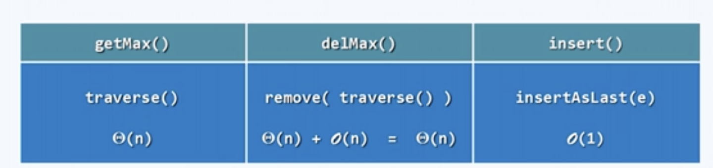
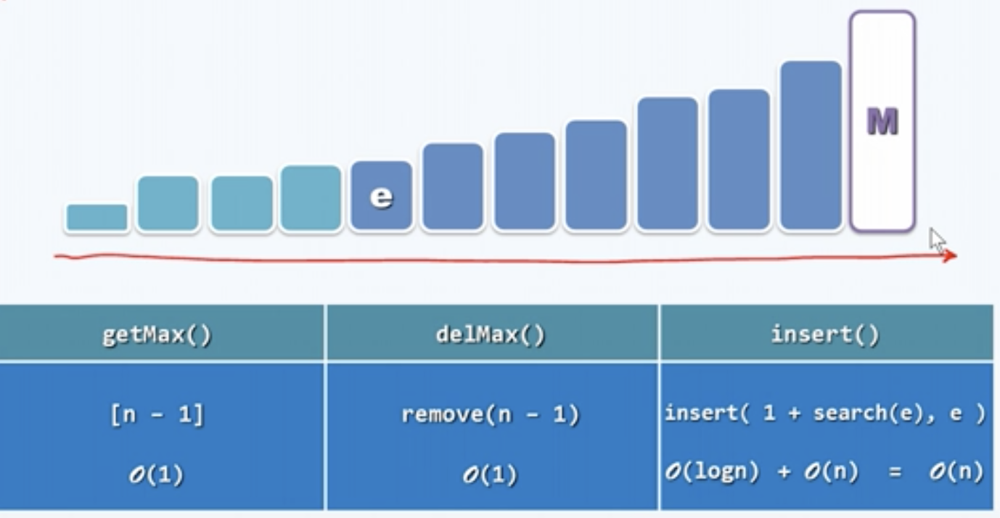
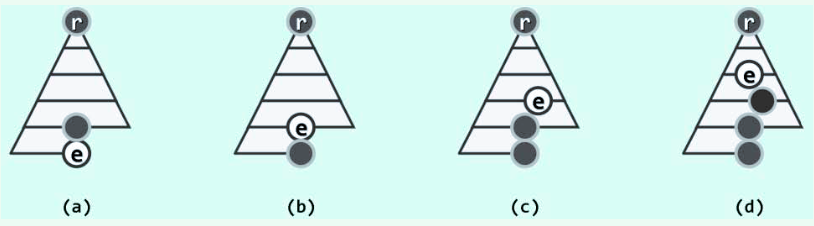
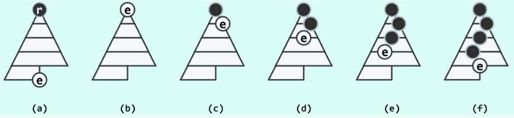
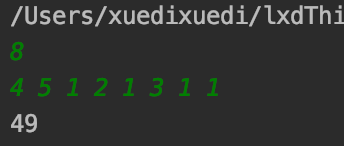
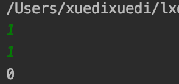

<h2 align="center">Project documentation</h2>
<h1 align="center">Data structure course design</h1>
<h2 align="right">——Repair the ranch</h2>


<p align="right">
  Author name：<U>Xuedi Liu</U><br>
  Number：<U>1752985</U><br>
  instructor：<U>Ying Zhang</U><br>
  College/Major：<U>School of Software Engineering/Software Engineering</U><br>
</p>


<div STYLE="page-break-after:always;">
</div>

<div STYLE="page-break-after:always;">
</div>

[TOC]

- **Operating Environment**:
  - Unix executables: running on **Unix** platforms
  - Linux executables: running on **Linux** platforms
  - exe executable file: Windows Console Application, running on 64-bit Windows platform
- **Code hosting platform**: Github

<div STYLE="page-break-after:always;">
</div>

## 1. Analysis

### 1.1 Project background analysis

The farmer wants to repair a fence of the pasture. He measured the fence and found that $N$ pieces of wood are needed. Each piece of wood is an integer $Li$ length unit. So he bought a long piece of wood that can be sawn into $N$ pieces, that is, the wood The length is the sum of $Li$.
But the farmer himself does not have a saw, and the reward for asking someone to saw the wood is proportional to the length of the wood. For the sake of simplicity, let us consider the remuneration equal to the length of the sawn wood. For example, to cut a piece of wood of length 20 into three sections of length 8, 7, and 5, the first sawn piece of wood will be sawn into 12 and 8, which costs 20; the second sawn piece of wood will be sawed to length 12 7 and 5 cost 12 and total cost 32 yuan. If the wood is sawn into 15 and 5 the first time, and the wood is sawed into 7 and 8 the second time, then the total cost is 35 (greater than 32).

### 1.2 Project function requirements

#### 1. Input description

The first line of the input gives a positive integer $N$ ($N<10^4$), which means that the wood is to be sawn into $N$ pieces. 

The second line gives $N$ positive integers, indicating the length of each piece of wood.

#### 2. Output description

Output an integer, the minimum cost of sawing the wood into $N$ blocks.

<div STYLE="page-break-after:always;">
</div>

## 2. Design

### 2.1 Data structure design

According to the analysis of this question, to get the minimum cost of repairing the pasture, we need to divide the length of the fence into larger parts as much as possible, and then divide the larger parts into smaller lengths. The cost is proportional to the length of the entire piece of wood before sawing, so we need to ensure that every time we saw the wood, we can saw the big piece of wood as much as possible, and then cut the two parts as evenly as possible. open.

We consider the inverse of this process: select the two minimum lengths in the given length sequence to add and sum, and then calculate the result into the cost. Put the result into the length sequence again, and then select two The minimum length, repeat the previous operation until there is only one element in the sequence, the result is the total length, and the cost is the minimum cost.

For this problem, we need to always find the smallest value from the sequence.It is easy to think of it by using the priority queue method: the element can only be inserted at the end of the queue, and only the frontmost element of the queue can be taken out. The difference is that the priority queue is not arranged strictly according to the insertion order, but according to the priority of the elements in the queue (the priority in this question is the length of the fence).

There are many ways to implement priority queues.The easiest one to think of is to use vectors.Every time we insert an element, we insert the element directly at the end of the sequence.When we need to get the highest priority element, we This sequence is traversed and returned. This method is feasible, but its time complexity is high, which is specifically represented by the time complexity of the following figure:



The second method is to use an ordered vector, each time we insert an element, directly insert the element to the end of the sequence, and then traverse and adjust the sequence. Then when the highest priority element is returned, directly from the head of the queue This method optimizes the time complexity of the inserted and returned elements to $ O (1) $, and each time the sequence is adjusted, it still requires a high cost, as shown in the following figure:



At this time, we thought that we could use a tree structure (such as AVL tree, Red black tree) to implement this ordered structure, and we could successfully optimize the time complexity of the three commonly used interfaces to $O (logn)$, so that the efficiency With a high improvement, even the efficiency of the `getMax()` interface can be successfully improved to $O (n)$, but since we only need to find the extreme values in the sequence, we do not need to get a sequence with a very strict size relationship. So we only need to maintain a set of **partial** order relations, without spending more effort to maintain some **total order** relations. If it is stored in a tree structure, it is really overkill. So we have reasons to believe that we I can find a data structure, which is simpler, lower maintenance costs, and can also achieve the function required by this problem under the condition of time complexity $O (logn)$.

The following proposes a data structure called a "complete binary heap", which can well combine arrays and trees: take the "form" of the array and realize the "spirit" of the tree. A complete binary tree is an AVL tree with a non-negative number of balancing factors The tree, intuitively, looks like this:


The advantage of this data structure is that we can directly traverse the complete binary tree in layer order and directly put it into the array, and we can use the array to implement the tree structure:


In detail, suppose the rank of a node is i, and the corresponding relations of the ranks of its parent node, left child node, and right child node are:

$parent(i) = (i-1) >> 1$

$lChild(i) = 1 + (i << 1)$

$rChild(i) = (1 + i) << 1$

In this way, by building the minimum heap and implementing the detailed functions of this data structure, all the requirements of this question can be well realized.

### 2.2 Class structure design

It is not difficult to see from the order of the heap that the highest priority entry in the heap must always be at the top of the heap. Therefore, the `getMax()` operation of the heap structure can always be completed in $O (1)$ time.

Heap ordering can also be symmetrically agreed as "Every node other than the top of the heap is not lower (smaller) than its parent". At the same time, the lowest priority entry must always be at the top of the heap. In order to show the difference, the former (the latter) is usually called the large (small) top stack. The small top heap and the large top heap are relative and can be converted to each other.

In the implementation of the heap, there are two main operations: insertion and deletion.Among them, insertion involves percolating up of elements, and deletion involves percolating down of elements.

#### 1. Percolate up



It may be assumed that the original heap is not empty, so the father $p$ (dark node) of the new element $e$ must exist. According to the corresponding rank of $e$ in the vector,

The rank corresponding to p can be easily determined. At this time, if the comparison determines that $e \leq p$, the heap orderness is satisfied locally and even the entire heap, and the insert operation is thus completed.

Conversely, if $e> p$, then $e$ and $p$ can be swapped in the vector. As shown in the figure, not only the structure of the whole heap is still satisfied, but also the heap order between e and $p$ is restored.

Of course, after that, $e$ and his new father may violate the ordering again. If this is the case, you can continue to apply the above method, as shown in the figure to exchange the two positions. Of course, as long as necessary, this exchange operation can be repeated continuously thereafter.

With each exchange, the new entry $e$ climbs up one level, so this process is also called percolate up. Of course, $e$ is at the very top of the filter pile. After the first stage of filtering is completed, the heap order of the whole heap will be restored.

#### 2. Percolate down



If the new heap top e does not satisfy the heap sequence, $e$ is swapped with the larger of its (up to) two children (dark nodes in the figure). As with the percolating up, the rank of the child can be easily determined according to the rank of the entry $e$ because of the use of vectors to implement the heap. Since then, the possible flaws in the heap will still come only from the entry $e$ —— it and the new child may once again be against the heap's sequence. If this is the case, you may wish to continue to use the above method, $e$ and the new child of the older person to exchange, the results are shown in the figure. In fact, this exchange operation is repeated again and again thereafter, as long as necessary.

As each entry e goes down, the adjustment process is also called percolate down. In the same way as above, this process will inevitably end. The heap order of the whole heap is bound to be restored; moreover, the time complexity of the percolating down and even the entire deletion algorithm is also $O (logn).

### 2.3 Member and operational design

#### 1. PriorityQueue

**Private：**

```C++
private:
    int _size;
    int *_data;//Minimum heap for sequence traversal

    int parent(int i) { return ((i - 1) >> 1); }//Returns the parent node of the node indexed by i
    int lChild(int i) {
        return (1 + (i << 1));
    }

    int rChild(int i) {
        return ((1 + i) << 1);
    }

    bool inHeap(int i) { return i >= 0 && i < _size; }

    void swap(int i, int j);//swap

```

**Public operation：**

```c++
public:
    PriorityQueue() {
        _size = 0;
        _data = nullptr;
    };

    explicit PriorityQueue(int size) {
        _size = size;
        _data = new int[size];
        _data[size] = {0};
    };

    int size() { return _size; }

    int top() { return _data[0]; };

    void pop();

    void insert(int n);
};

```

**Core function：**

Swap：

```c++
void PriorityQueue::swap(int i, int j) {
    int temp;
    temp = _data[i];
    _data[i] = _data[j];
    _data[j] = temp;
}
```

Insert：

```c++
void PriorityQueue::insert(int n) {
    if (_size == 0) {
        _data[0] = n;
        _size++;
        return;
    }
    _data[_size] = n;
    int i = _size;
    _size++;
    while (i > 0) {
        int j = parent(i);//j is the rank of i's father node
        if (_data[j] > _data[i]) {
            swap(i, j);
            i = j;
        } else {
            break;
        }
    }

}
```

Delete top element：

```c++
void PriorityQueue::pop() {
    swap(0, _size - 1);
    _data[_size - 1] = 0;
    _size--;
    int i = 0;
    while (inHeap(i)) {
        int j = lChild(i);
        int k = rChild(i);//k must > j
        int t;
        if (inHeap(k)) {
            if (_data[j] < _data[k]) {
                t = j;
            } else {
                t = k;
            }
        } else if (inHeap(j)) {
            t = j;
        } else {
            break;
        }
        if (_data[t] < _data[i]) {
            swap(i, t);
            i = t;
        } else {
            break;
        }
    }
}
```

<div STYLE="page-break-after:always;">
</div>

## 3. Realization

### 3.1 Implementation of the main function

#### 1. Main function flowchart:

.png)

#### 2. Main function core code

```c++
int main() {
    int times;
    cin >> times;
    auto q = new PriorityQueue(0);
    for (int i = 0; i < times; i++) {
        int num;
        cin >> num;
        q->insert(num);
    }

    int tempAns = 0;
    while (q->size() > 1) {
        int a = q->top();
        q->pop();
        int b = q->top();
        q->pop();
        tempAns += (a + b);
        q->insert(a + b);
    }
    cout << tempAns;

    return 0;
}
```

<div STYLE="page-break-after:always;">
</div>

## 4. Test

### 4.1 Normal test

####Normal input result

**input：**

8

4 5 1 2 1 3 1 1

**Expected outcome：** 

49

**Experimental result：**



### 4.2 Boundary test

#### The input n is 1, that is, the wood remains as it is

**Test case：**

1

1

**Expected outcome：**

0

**Experimental result：**



