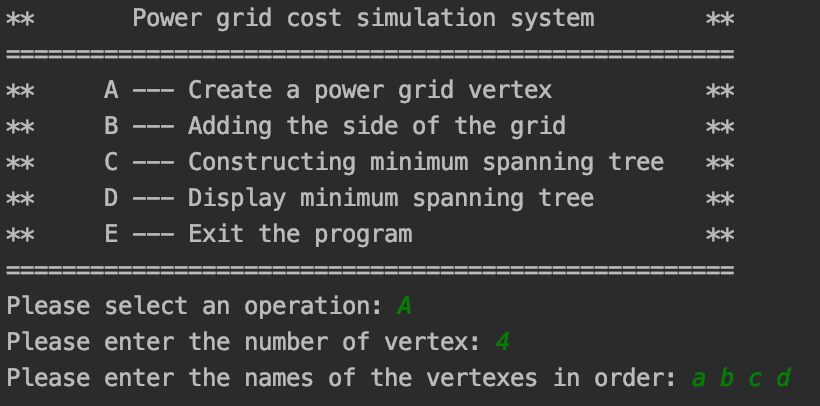
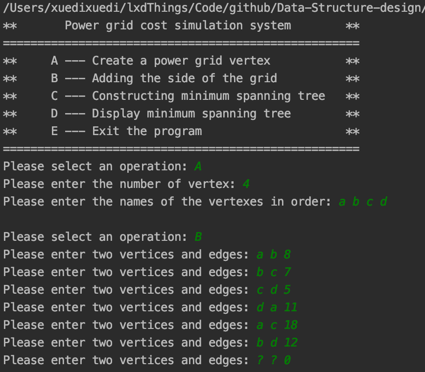
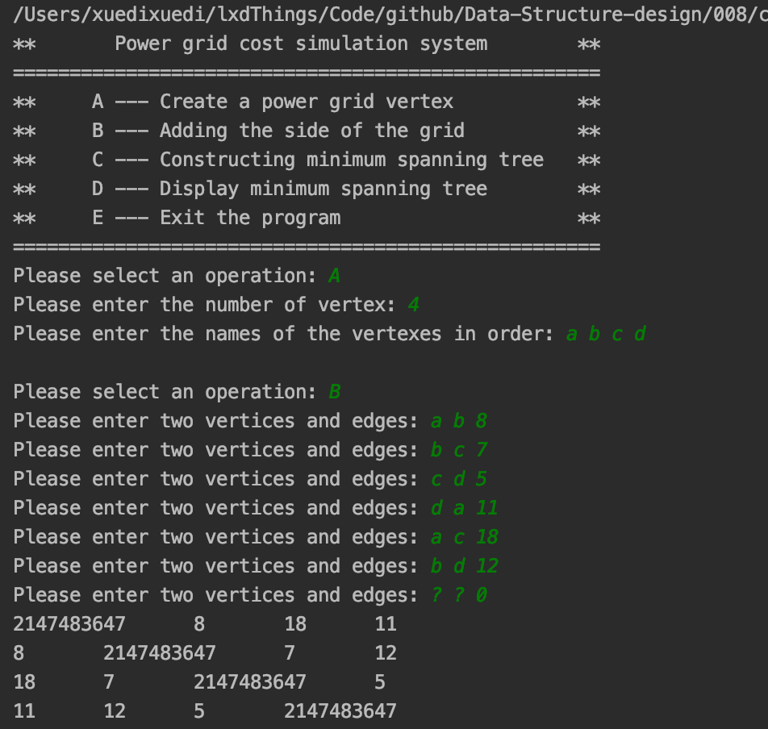
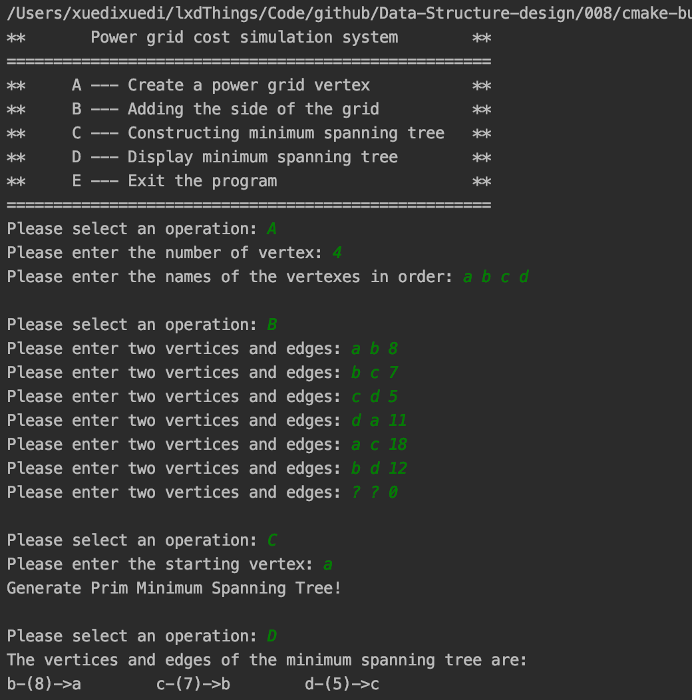
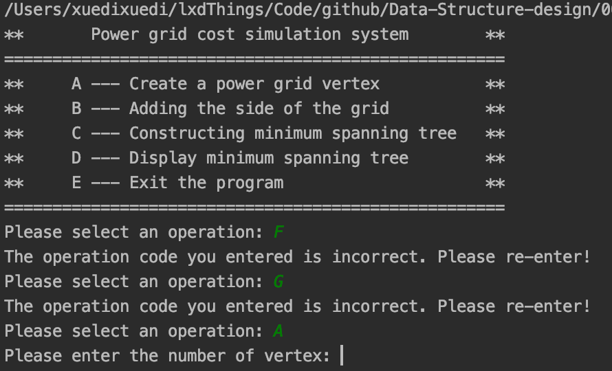
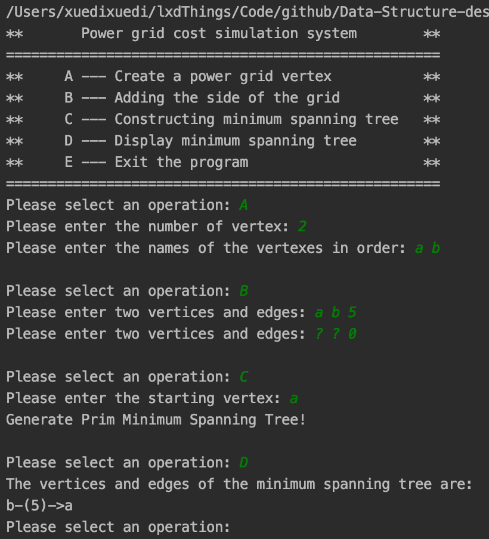

<h2 align="center">Project documentation</h2>
<h1 align="center">Data structure course design</h1>
<h2 align="right">——Grid Construction Cost Simulation System</h2>


<p align="right">
  Author name：<U>Xuedi Liu</U><br>
  Number：<U>1752985</U><br>
  instructor：<U>Ying Zhang</U><br>
  College/Major：<U>School of Software Engineering/Software Engineering</U><br>
</p>


<div STYLE="page-break-after:always;">
</div>

<div STYLE="page-break-after:always;">
</div>

[TOC]

- **Operating Environment**:
  - Unix executables: running on **Unix** platforms
  - Linux executables: running on **Linux** platforms
  - exe executable file: Windows Console Application, running on 64-bit Windows platform
- **Code hosting platform**: Github

<div STYLE="page-break-after:always;">
</div>

## 1. Analysis

### 1.1 Project background analysis

Assume that there are n communities in a city. To realize that the power grids between the n communities can be connected to each other, the power grid between the n communities in this city is constructed so as to minimize the total project cost. Please design a cost solution that can meet the requirements.

### 1.2 Project function requirements

A grid line can be set up between each district, and corresponding economic costs must be paid. There can be at most n (n-1) / 2 lines between n cells, and choosing n-1 of them can minimize the total cost.

<div STYLE="page-break-after:always;">
</div>

## 2. Design

### 2.1 Data structure design

The power grid is a typical graph data structure,whiche consists of a finite set of vertices(or nodes) and set of Edges which connect a pair of nodes.The above sentence is the definition of the graph,A Graph is a non-linear data structure consisting of nodes and edges. The nodes are sometimes also referred to as vertices and the edges are lines or arcs that connect any two nodes in the graph. 


In the above Graph, the set of vertices $V = {0,1,2,3,4}$ and the set of edges$ E = {01, 12, 23, 34, 04, 14, 13}$.

Graphs are used to solve many real-life problems. Graphs are used to represent networks. The networks may include paths in a city or telephone network or circuit network. Graphs are also used in social networks like linkedIn, Facebook. For example, in Facebook, each person is represented with a vertex(or node). Each node is a structure and contains information like person id, name, gender, locale etc.

The "create grid vertex" function of this question corresponds to the point of creating a graph structure and determining the size of the graph. The corresponding operation of "adding the edge of the grid" is to construct the edges of the graph. For the convenience of coding this question and the subsequent implementation of the minimum spanning tree, this question uses a storage structure called adjacency matrix to store graph structure.

Graph is a data structure that consists of following two components:
**1.** A finite set of vertices also called as nodes.
**2.** A finite set of ordered pair of the form $(u, v)$ called as edge. The pair is ordered because $(u, v)$ is not same as $(v, u)$ in case of a directed graph(di-graph). The pair of the form $(u, v)$ indicates that there is an edge from vertex $u$ to vertex $v$. The edges may contain weight/value/cost.

Now let's analyze the five-vertex graph in the previous figure :

Following two are the most commonly used representations of a graph.

1. Adjacency Matrix
2. Adjacency List

There are other representations also like, Incidence Matrix and Incidence List. The choice of the graph representation is situation specific. It totally depends on the type of operations to be performed and ease of use.

**Adjacency Matrix:**
Adjacency Matrix is a 2D array of size $V \times V$ where $V$ is the number of vertices in a graph. Let the 2D array be $adj[][]$, a slot $adj[i][j] = 1$ indicates that there is an edge from vertex $i$ to vertex $j$. Adjacency matrix for undirected graph is always symmetric. Adjacency Matrix is also used to represent weighted graphs. If $adj[i][j] = w$, then there is an edge from vertex $i$ to vertex $j$ with weight $w$.

The adjacency matrix for the above example graph is:


>
>
>*Pros:* Representation is easier to implement and follow. Removing an edge takes $O(1)$ time. Queries like whether there is an edge from vertex ‘u’ to vertex ‘v’ are efficient and can be done $O(1)$.
>
>*Cons:* Consumes more space $O(V^2)$. Even if the graph is sparse(contains less number of edges), it consumes the same space. Adding a vertex is $O(V^2)$ time.

**Adjacency List:**
An array of lists is used. Size of the array is equal to the number of vertices. Let the array be $array[ ]$. An entry $array[i]$ represents the list of vertices adjacent to the $i$th vertex. This representation can also be used to represent a weighted graph. The weights of edges can be represented as lists of pairs. Following is adjacency list representation of the above graph.


### 2.2 Algorithm design

The main algorithm involved in this problem is the **Prim algorithm** used to construct the minimum spanning tree.

####Prim’s Minimum Spanning Tree (MST) 

Prim’s algorithm is a Greedy algorithm. It starts with an empty spanning tree. The idea is to maintain **two sets of vertices**. The first set contains the vertices already included in the MST, the other set contains the vertices not yet included. At every step, it considers all the edges that connect the two sets, and picks the minimum weight edge from these edges. After picking the edge, it moves the other endpoint of the edge to the set containing MST.
A group of edges that connects two set of vertices in a graph is called cut in graph theory. So, at every step of Prim’s algorithm, we find a cut (of two sets, one contains the vertices already included in MST and other contains rest of the verices), pick the minimum weight edge from the cut and include this vertex to MST Set (the set that contains already included vertices).

*How does Prim’s Algorithm Work?* The idea behind Prim’s algorithm is simple, a spanning tree means all vertices must be connected. So the two disjoint subsets (discussed above) of vertices must be connected to make a **Spanning Tree**. And they must be connected with the minimum weight edge to make it a **Minimum Spanning Tree**.

**Algorithm**

1. Create a set *mstSet* that keeps track of vertices already included in MST.
2. Assign a key value to all vertices in the input graph. Initialize all key values as INFINITE. Assign key value as 0 for the first vertex so that it is picked first.
3. While *mstSet* doesn’t include all vertices
   + Pick a vertex $u$ which is not there in *mstSet* and has minimum key value.
   + Include $u$ to *mstSet*.
   + Update key value of all adjacent vertices of $u$. To update the key values, iterate through all adjacent vertices. For every adjacent vertex $v$, if weight of edge $u-v$ is less than the previous key value of $v$, update the key value as weight of $u-v$.

The idea of using key values is to pick the minimum weight edge from cut]. The key values are used only for vertices which are not yet included in MST, the key value for these vertices indicate the minimum weight edges connecting them to the set of vertices included in MST.

Next, an example of constructing a minimum spanning tree using the Prim algorithm is shown:


The set *mstSet* is initially empty and keys assigned to vertices are {$0, INF, INF, INF, INF, INF, INF, INF$ }​ where $INF$ indicates infinite. Now pick the vertex with minimum key value. The vertex 0 is picked, include it in *mstSet*. So *mstSet* becomes {0}. After including to *mstSet*, update key values of adjacent vertices. Adjacent vertices of 0 are 1 and 7. The key values of 1 and 7 are updated as 4 and 8. Following subgraph shows vertices and their key values, only the vertices with finite key values are shown. The vertices included in MST are shown in green color.


Pick the vertex with minimum key value and not already included in MST (not in mstSET). The vertex 1 is picked and added to mstSet. So mstSet now becomes {0, 1}. Update the key values of adjacent vertices of 1. The key value of vertex 2 becomes 8.


Pick the vertex with minimum key value and not already included in MST (not in mstSET). We can either pick vertex 7 or vertex 2, let vertex 7 is picked. So mstSet now becomes {0, 1, 7}. Update the key values of adjacent vertices of 7. The key value of vertex 6 and 8 becomes finite (1 and 7 respectively).


Pick the vertex with minimum key value and not already included in MST (not in mstSET). Vertex 6 is picked. So mstSet now becomes {0, 1, 7, 6}. Update the key values of adjacent vertices of 6. The key value of vertex 5 and 8 are updated.


We repeat the above steps until *mstSet* includes all vertices of given graph. Finally, we get the following graph.


### 2.3 Member and operational design

#### 1. Graph

**Private：**

```C++
private:
    char *_name;         //An array of vertex names
    int **_matrix;       //Adjacency matrix representation
    bool **_primMatrix;  //Minimum Spanning Tree Edge
    int _size;           //Vertices
    int *_parent;        //Parent node in the minimum spanning tree
    bool *_visit;
    int *_score;
    int _sum;  //Shortest path sum

```

**Public operation：**

```c++
public:
    Graph() = default;
    Graph(int size, char *name, int **matrix) {
        _size = size;
        _name = name;
        _sum = 0;
        _matrix = matrix;
        _parent = new int[size];
        _parent[size] = {-1};
        _visit = new bool[size];
        _visit[size] = {false};
        _score = new int[size];
        _score[size] = {INT_MAX};
        _primMatrix = new bool *[size];
        _primMatrix[size] = new bool[size];
        _primMatrix[size][size] = {false};
    }
    void initMatrix(char vertex1, char vertex2, int side);
    void printMatrix();
    void prim(char vertex);  //Generate minimal spanning tree with vertex as vertex
    void displayTree();

```

**Core function：**

Initialize adjacency matrix ：

```c++
void Graph::initMatrix(char vertex1, char vertex2, int side) {
    for (int i = 0; i < _size; ++i) {
        if (_name[i] == vertex1 || _name[i] == vertex2) {
            for (int j = i + 1; j < _size; ++j) {
                if (_name[j] == vertex2 || _name[j] == vertex1) {
                    _matrix[i][j] = side;
                    _matrix[j][i] = side;
                    break;
                }
            }
        }
    }
}
```

Print adjacency matrix：

```c++
void Graph::printMatrix() {
    for (int i = 0; i < _size; ++i) {
        for (int j = 0; j < _size; ++j) {
            std::cout << _matrix[i][j] << ' ';
        }
        std::cout << '\n';
    }
}
```

Print minimal spanning tree：

```c++
void Graph::displayTree() {
    for (int i = 0; i < _size; ++i) {
        if (_score[i] != INT_MAX) {
            std::cout << _name[i] << "-(" << _score[i] << ")->"
                      << _name[_parent[i]] << "\t\t";
        }
    }
}
```

Building a minimum spanning tree with the Prim algorithm:

```c++
void Graph::prim(char vertex) {
    //Three things are maintained: selected minDist parent
    int s;
    //Find the subscript corresponding to vertex
    for (int i = 0; i < _size; ++i) {
        if (_name[i] == vertex) {
            s = i;
        }
    }
    for (int i = 0; i < _size; ++i) {
        _score[i] = _matrix[s][i];
        _parent[i] = s;
        _visit[i] = false;
    }
    _visit[s] = true;

    int minCost = 0;
    int minid = 0;
    for (int i = 0; i < _size - 1; ++i) {
        minCost = INT_MAX;
        for (int j = 0; j < _size; ++j) {
            if (_visit[j] == false && _score[j] < minCost) {
                minCost = _score[j];
                minid = j;
            }
        }
        _visit[minid] = true;
        _sum += minCost;

        for (int j = 0; j < _size; ++j) {
            if (_visit[j] == false && _matrix[minid][j] < _score[j]) {
                _score[j] = _matrix[minid][j];
                _parent[j] = minid;
            }
        }
    }
    std::cout << "Generate Prim Minimum Spanning Tree!" << std::endl;
}
```

<div STYLE="page-break-after:always;">
</div>

## 3. Realization

### 3.1 Implementation of building a graph

#### 1. Building function core code

```c++
Graph *init() {
    cout << "Please enter the number of vertex: ";
    int size = 0;
    cin >> size;
    while (size < 2) {
        cout << "the number of vertex cannnot be less than 2. Please enter again: ";
        cin >> size;
    }
    cout << "Please enter the names of the vertexes in order: ";
    char name;
    char *namelist = new char;
    auto matrix = new int *[size];
    for (int i = 0; i < size; ++i) {
        cin >> name;
        namelist[i] = name;
        matrix[i] = new int[size];
        for (int j = 0; j < size; ++j) {
            matrix[i][j] = INT_MAX;
        }
    }

    auto grid = new Graph(size, namelist, matrix);
    return grid;
}
```

#### 2.Building function diagram



The adjacency matrix of the initial state：


### 3.2 Implementation of adding side

#### 1. Adding function core code:

```c++
void addSide(Graph *grid) {
    char vertex1, vertex2;
    int side;
    while (true) {
        cout << "Please enter two vertices and edges: ";
        cin >> vertex1 >> vertex2 >> side;
        if (vertex1 == '?') {
            break;
        } else {
            grid->initMatrix(vertex1, vertex2, side);
        }
    }
    // grid->printMatrix();
}
```

#### 2. Adding function diagram:



Adjacency matrix after adding edges:



### 3.3 Implement of construction and display the minimum spanning tree function

#### 1. Core function

```c++
void minTree(Graph *grid) {
    cout << "Please enter the starting vertex: ";
    char v;
    cin >> v;
    grid->prim(v);
}
```

```c++
void showTree(Graph *grid) {
    cout << "The vertices and edges of the minimum spanning tree are: " << endl;
    grid->displayTree();
}
```

#### 2. Diagram



<div STYLE="page-break-after:always;">
</div>

## 4. Test

### 4.1 Normal test

####Normal input result

**input：**

the number of vertex: 4

the names of the vertexes in order: a b c d

two vertices and edges:

a b 8

b c 7

c d 5

d a 11

a c 18

b d 12

? ? 0

the starting vertex: a

**Expected outcome：** 

b-(8)->a		c-(7)->b		d-(5)->c	

**Experimental result：**


### 4.2 Error test

#### 1. Operation code error

**Test case：**

Enter a wrong operation code

**Expected outcome：**

Program output error prompt, normal operation does not crash

**Experimental result：**



#### 2. Wrong number of vertex

**Test case：**

The number of vertex input is less than 2

**Expected outcome：**

Program output error prompt, normal operation does not crash

**Experimental result：**


### 4.3 Boundary test

#### 1. Graph with only two vertices

**Test case：**

Init a graph with only 2 vertexes

**Expected outcome：**

Program gives correct result

**Experimental result：**

