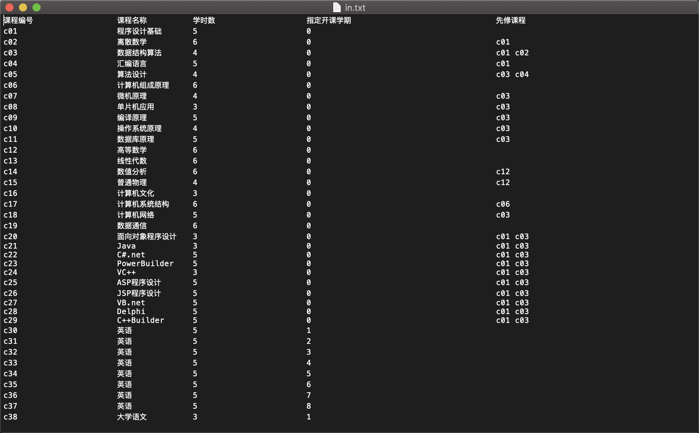
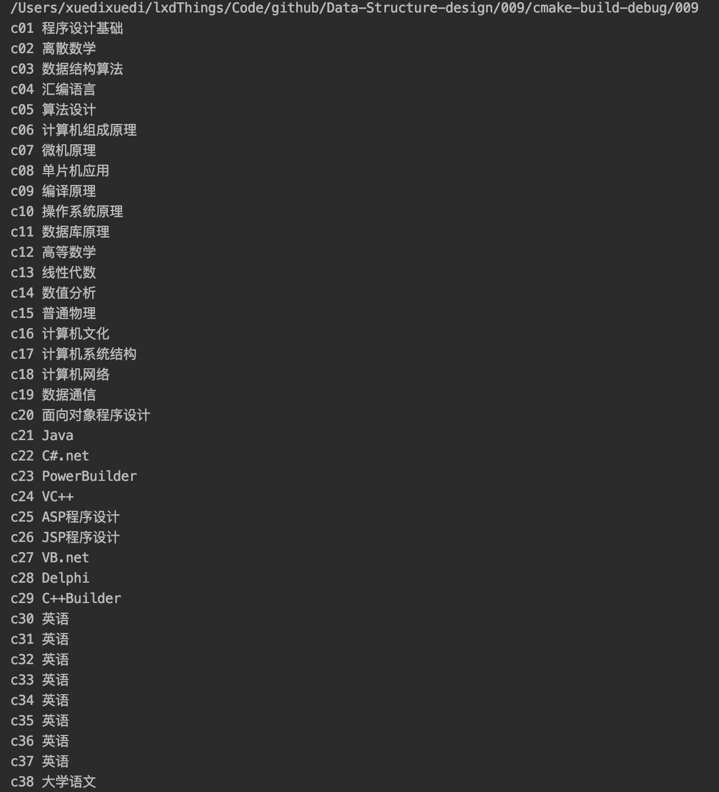
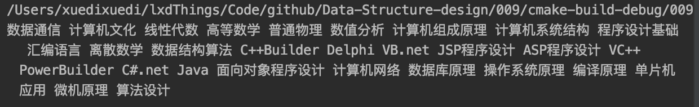
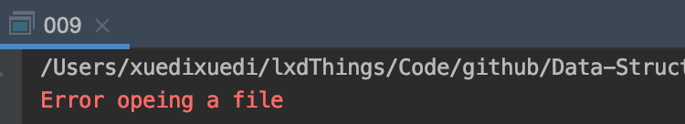

<h2 align="center">Project documentation</h2>
<h1 align="center">Data structure course design</h1>
<h2 align="right">——Course scheduling software</h2>


<p align="right">
  Author name：<U>Xuedi Liu</U><br>
  Number：<U>1752985</U><br>
  instructor：<U>Ying Zhang</U><br>
  College/Major：<U>School of Software Engineering/Software Engineering</U><br>
</p>


<div STYLE="page-break-after:always;">
</div>

<div STYLE="page-break-after:always;">
</div>

[TOC]

> - **Operating Environment**:
>   - Unix executables: running on **Unix** platforms
>   - Linux executables: running on **Linux** platforms
>   - exe executable file: Windows Console Application, running on 64-bit Windows platform
> - **Code hosting platform**: Github

<div STYLE="page-break-after:always;">
</div>


## 1. Analysis

### 1.1 Project background analysis

Courses are arranged for each major at the university. Assume that any major has a fixed period of study. Each academic year contains two semesters. The courses offered by each major are determined, and the schedule of the courses must meet the prerequisite relationship. The prerequisites for each course are determined. Each course takes exactly one semester, assuming that there are five lessons each morning and afternoon. It is on this premise to design a teaching plan preparation process.

### 1.2 Project function requirements

1. The input data includes: the number of courses offered per semester (the sum of the number of courses offered per semester must be equal to the total number of courses), the course number, the course name, the number of weekly hours, the designated start semester, the prerequisites If the designated start semester is 0, it means that there is a computer to designate the start semester.
2. If the input data is not reasonable, such as the number of courses offered each semester and the total number of courses are not equal, appropriate prompt information should be displayed.
3. Store the input data in a text file and load it into the computer.
4. Use text files to store the lesson schedules for each semester.

**Schedule requirements and course information:**

Assume that there are classes from Monday to Friday. There are 10 lessons per day. The first major session is 1-2. The second major session is 3-5. The third major session is 6-7. The 4 major sections are 8-10 lessons. When arranging lessons, if there are 3 lessons in a course, 3 consecutive lessons will be given priority; if 3 consecutive lessons cannot be arranged, then 2 lessons will be given consecutively. Reschedule a single lesson; if a course needs to be scheduled for two days, for better teaching results, it is best not to arrange for two consecutive days, such as giving priority to two lessons apart, and set weekday to indicate that the current schedule Working day, the working day of the next scheduled class is:

$ weekday = (weekday + 2-5)? (Weekday + 2-5): (weekday + 2);$

<div STYLE="page-break-after:always;">
</div>

## 2. Design

### 2.1 Data structure design

The schedual is a typical graph data structure,whiche consists of a finite set of vertices(or nodes) and set of Edges which connect a pair of nodes.The above sentence is the definition of the graph,A Graph is a non-linear data structure consisting of nodes and edges. The nodes are sometimes also referred to as vertices and the edges are lines or arcs that connect any two nodes in the graph. 


In the above Graph, the set of vertices $V = {0,1,2,3,4}$ and the set of edges$ E = {01, 12, 23, 34, 04, 14, 13}$.

Graphs are used to solve many real-life problems. Graphs are used to represent networks. The networks may include paths in a city or telephone network or circuit network. Graphs are also used in social networks like linkedIn, Facebook. For example, in Facebook, each person is represented with a vertex(or node). Each node is a structure and contains information like person id, name, gender, locale etc.

The "create grid vertex" function of this question corresponds to the point of creating a graph structure and determining the size of the graph. The corresponding operation of "adding the edge of the grid" is to construct the edges of the graph. For the convenience of coding this question and the subsequent implementation of the minimum spanning tree, this question uses a storage structure called adjacency matrix to store graph structure.

Graph is a data structure that consists of following two components:
**1.** A finite set of vertices also called as nodes.
**2.** A finite set of ordered pair of the form $(u, v)$ called as edge. The pair is ordered because $(u, v)$ is not same as $(v, u)$ in case of a directed graph(di-graph). The pair of the form $(u, v)$ indicates that there is an edge from vertex $u$ to vertex $v$. The edges may contain weight/value/cost.

Now let's analyze the five-vertex graph in the previous figure :

Following two are the most commonly used representations of a graph.

1. Adjacency Matrix
2. Adjacency List

There are other representations also like, Incidence Matrix and Incidence List. The choice of the graph representation is situation specific. It totally depends on the type of operations to be performed and ease of use.

**Adjacency Matrix:**
Adjacency Matrix is a 2D array of size $V \times V$ where $V$ is the number of vertices in a graph. Let the 2D array be $adj[][]$, a slot $adj[i][j] = 1$ indicates that there is an edge from vertex $i$ to vertex $j$. Adjacency matrix for undirected graph is always symmetric. Adjacency Matrix is also used to represent weighted graphs. If $adj[i][j] = w$, then there is an edge from vertex $i$ to vertex $j$ with weight $w$.

The adjacency matrix for the above example graph is:


>
>
>*Pros:* Representation is easier to implement and follow. Removing an edge takes $O(1)$ time. Queries like whether there is an edge from vertex ‘u’ to vertex ‘v’ are efficient and can be done $O(1)$.
>
>*Cons:* Consumes more space $O(V^2)$. Even if the graph is sparse(contains less number of edges), it consumes the same space. Adding a vertex is $O(V^2)$ time.

**Adjacency List:**
An array of lists is used. Size of the array is equal to the number of vertices. Let the array be $array[ ]$. An entry $array[i]$ represents the list of vertices adjacent to the $i$th vertex. This representation can also be used to represent a weighted graph. The weights of edges can be represented as lists of pairs. Following is adjacency list representation of the above graph.


### 2.2 Algorithm design

The main algorithm involved in this problem is the **Topological sort** used to construct the minimum spanning tree.

Topological sorting for Directed Acyclic Graph (DAG) is a linear ordering of vertices such that for every directed edge uv, vertex u comes before v in the ordering. Topological Sorting for a graph is not possible if the graph is not a DAG.

For example, a topological sorting of the following graph is “5 4 2 3 1 0”. There can be more than one topological sorting for a graph. For example, another topological sorting of the following graph is “4 5 2 3 1 0”. The first vertex in topological sorting is always a vertex with in-degree as 0 (a vertex with no incoming edges).


**Topological Sorting vs Depth First Traversal (DFS)**:
In DFS, we print a vertex and then recursively call DFS for its adjacent vertices. In topological sorting, we need to print a vertex before its adjacent vertices. For example, in the given graph, the vertex ‘5’ should be printed before vertex ‘0’, but unlike DFS, the vertex ‘4’ should also be printed before vertex ‘0’. So Topological sorting is different from DFS. For example, a DFS of the shown graph is “5 2 3 1 0 4”, but it is not a topological sorting.

**Algorithm to find Topological Sorting:**

We recommend to first see implementation of DFS here. We can modify DFS to find Topological Sorting of a graph. In DFS , we start from a vertex, we first print it and then recursively call DFS for its adjacent vertices. In topological sorting, we use a temporary stack. We don’t print the vertex immediately, we first recursively call topological sorting for all its adjacent vertices, then push it to a stack. Finally, print contents of stack. Note that a vertex is pushed to stack only when all of its adjacent vertices (and their adjacent vertices and so on) are already in stack.

Simply put, the method of topological sorting can be summarized as:

1. Find points with a degree of 0 and put them into a sorted sequence
2. Delete all edges emitted by this point
3. Continue to find the next point with a degree of 0, put it into the sequence, and repeat the above steps
4. Until all nodes are put into the sequence.

Below image is an illustration of the above approach:


### 2.3 Member and operational design

#### 1. Course

**Private：**

```C++
std::string _number;//课程编号
    std::string _name;//课程名字
    int _time;//学时数
    int _semester;//开课学期
    bool _havePre;
    int _degree;//入度
		std::vector<std::string> _pre;
```

**Public operation：**

```c++
Course() {
        _number = "0";
        _name = "0";
        _havePre = false;
        _degree = 0;

    }

    Course(std::string &nu, std::string &na, int ti, int se, bool ha) {
        _number = nu;
        _name = na;
        _time = ti;
        _semester = se;
        _havePre = ha;
    }
```

#### 2. Graph

**Data & functions: **

```c++
public:
    std::vector<Course> _name;         //储存顶点名称的数组
    std::vector<Course> _classname;  //在矩阵中有用的顶点们
    int _matrix[29][29];       //邻接矩阵表示
    int _size;           //course name数
    int _vertexes;  //真实的顶点数
    std::vector<Course> _classlist;//拓扑排序后的课程顺序
    Graph() = default;

    Graph(std::vector<Course> course) {
        _name = course;
        _size = course.size();
        _vertexes = 0;
    }

    void initMatrix();

    bool findInDegree(Course co);//查找入度为0的顶点
    std::vector<Course> topologicalSort();
```

**Core function：**

Initialize adjacency matrix ：

```c++
void Graph::initMatrix() {
    for (auto &i : _name) {
        if (!i._semester) {
            _classname.push_back(i);
        }
    }
    _vertexes = _classname.size();
    int mat[_vertexes][_vertexes];
    for (int i = 0; i < _vertexes; ++i) {
        for (int j = 0; j < _vertexes; ++j) {
            mat[i][j] = 0;
            if (_classname[j]._havePre) {
                //j的前驱是i，也就是i的后继是j matrix[i][j]置1
                for (auto it = _classname[j]._pre.begin(); it != _classname[j]._pre.end(); ++it) {
                    if (*it == _classname[i]._number) {
                        mat[i][j] = 1;
                    }
                }
            }
        }
    }

    for (int i = 0; i < _vertexes; ++i) {
        for (int j = 0; j < _vertexes; ++j) {
            _matrix[i][j] = mat[i][j];
        }
    }
}
```

Find vertex's  degree：

```c++
void Graph::findInDegree() {
    for (int i = 0; i < _classname.size(); ++i) {
        std::cout << _classname[i]._degree << " ";
        _inDegree.push_back(_classname[i]._degree);
        if (_inDegree[i] == 0) {
            stk.push(i);
        }

    }
}
```

Topological Sorting

```c++
std::vector<Course> Graph::topologicalSort() {
    std::vector<Course> ans;
    findInDegree();
    int v;//下标
    while (!stk.empty()){
        v = stk.top();
        stk.pop();
        for(int i = 0;i < _classname.size();++i){
            if(_matrix[v][i] == 1){
                _inDegree[i] --;
                if(_inDegree[i] == 0){
                    stk.push(i);
                }
            }
        }
        ans.push_back(_classname[v]);
    }
        _classlist = ans;
    for (auto it = ans.begin(); it != ans.end(); ++it) {
        std::cout << it->_name << ' ';
    }
    return ans;
}
```

<div STYLE="page-break-after:always;">
</div>

## 3. Realization

### 3.1 Implementation of Reading files and processing data

#### 1. Reading file core code

```c++
ector<Course> readFile() {
    ifstream ifs;//输入
    ofstream ofstream1;//输出
    ifs.open("../in.txt");
    if (ifs.fail()) {
        cerr << "Error opeing a file" << endl;
        ifs.close();
        exit(1);
    }
    auto line = new string[10000];
    int num = 0;
    while (ifs >> line[num]) {
        num++;
    }

    vector<Course> courses;
    int j = 0;
    for (int i = 5; i < num; ++i) {
        if (line[i][0] == 'c' && line[i + 1][0] != 'c') {
            //判断是否为课号
            Course co;
            j++;//新增一个课程
            co._number = line[i];
            co._name = line[i + 1];
            int ti = stoi(line[i + 2]);
            int se = stoi(line[i + 3]);
            co._time = ti;
            co._semester = se;
            co._degree = 0;
            int k = i + 4;
            int m = 0;
            while (line[k][0] == 'c' && line[k + 1][0] == 'c') {
                co._havePre = true;
                co._pre.push_back(line[k]);
                co._degree++;
                m++;
                k++;
            }
            courses.push_back(co);
        }
    }


    ifs.close();
    return courses;//size
}
```

#### 2. Reading file diagram

**input file:**



**out put：**



### 3.2 Directed graph adjacency matrix construction

#### 1. Adjacency matrix construction core code

```c++
void Graph::initMatrix() {
    for (auto &i : _name) {
        if (!i._semester) {
            _classname.push_back(i);
        }
    }
    _vertexes = _classname.size();
    int mat[_vertexes][_vertexes];
    for (int i = 0; i < _vertexes; ++i) {
        for (int j = 0; j < _vertexes; ++j) {
            mat[i][j] = 0;
            if (_classname[j]._havePre) {
                //j的前驱是i，也就是i的后继是j matrix[i][j]置1
                for (auto it = _classname[j]._pre.begin(); it != _classname[j]._pre.end(); ++it) {
                    if (*it == _classname[i]._number) {
                        mat[i][j] = 1;
                    }
                }
            }
        }
    }

    for (int i = 0; i < _vertexes; ++i) {
        for (int j = 0; j < _vertexes; ++j) {
            _matrix[i][j] = mat[i][j];
        }
    }
}
```

#### 2. Adjacency matrix construction diagram

**input file:**


**out put：**


### 3.3 Implement of finding Topological Sorting Sequences

#### 1. Finding Topological Sorting Sequences core function

```c++
std::vector<Course> Graph::topologicalSort() {
    std::vector<Course> ans;
    for (int i = 0; i < _classname.size(); ++i) {
        if (findInDegree(_classname[i])) {
            //把入度为0的节点放入
            ans.push_back(_classname[i]);
            //把这个点的后继节点入度-1
            for (int j = 0; j < _classname.size(); ++j) {
                if (_matrix[i][j] == 1) {
                    _classname[j]._degree--;
                }
            }
        }
    }
    _classlist = ans;
    return ans;
}
```

#### 2. Diagram

**input file:**


**out put：**



### 3.4 Schedules Excluded Each Semester

#### 1. Output file core code:

```c++
void arrangeClass(int sem, Graph *gr) {
    int ttime = 0;//这些课程的总时间
    vector<Course> list;
    for (int i = 0; i < gr->_name.size(); ++i) {
        if (gr->_name[i]._semester == sem) {
            list.push_back(gr->_name[i]);
            ttime += gr->_name[i]._time;
        }
    }

    if (!gr->_classlist.empty()) {
        for (auto it = gr->_classlist.begin(); it != gr->_classlist.end(); ++it) {
            if (it->_semester == 0) {
                ttime += it->_time;
                list.push_back(*it);
                it->_semester = sem;
            }
            if (ttime > 20) {
                break;
            }
        }
    }

    outPut(sem, list);

}
```

```c++
//输出文件：
void outPut(int sem, vector<Course> ls) {
    string xx = "../out0.txt";
    xx[6] = static_cast<char> (sem);
    auto str = xx.c_str();
    ofstream out;
    out.open(str);
    out << "The " << sem << " semester's curriculum:" << endl;

    //我想先把ls按照课时数排一排
    sort(ls.begin(), ls.end(), cmp);
    for (int i = 0; i < ls.size(); ++i) {
//        cout << ls[i]._time << ' ';
    }

    int classtime[ls.size()];//对应课程的课时
    vector<Course> schedual;
    for (int i = 0; i < ls.size(); ++i) {
        classtime[i] = ls[i]._time;
    }

    for (int k = 0; k < 3; ++k) {
        for (int i = 0; i < ls.size(); ++i) {
            if (classtime[i]) {
                if (classtime[i] % 2) {
                    //奇数情况
                    schedual.push_back(ls[i]);
                    schedual.push_back(ls[i]);
                    schedual.push_back(ls[i]);
                    classtime[i] -= 3;
                } else {
                    //偶数情况
                    schedual.push_back(ls[i]);
                    schedual.push_back(ls[i]);
                    classtime[i] -= 2;
                }
            }
        }
    }

    int hd = 4;
    int num = 0;
    string temp1;

    for (int i = 0; i < schedual.size(); ++i) {
        num++;
        out << schedual[i]._name << '|';
        if (schedual[i]._number != schedual[i + 1]._number && schedual[i]._number == schedual[i - 2]._number) {
            num++;
            out << "    |";
        }
        if (num == 4) {
            num = 0;
            out << endl;
        }
    }

    out.close();

}
```

#### 2. Output timetable

Semester 1:

| Mon      | Tues         | Wed          | Thri     | Fri          |
| -------- | ------------ | ------------ | -------- | ------------ |
| 数据通信 | 程序设计基础 | 程序设计基础 | 数据通信 |              |
| 数据通信 | 计算机文化   | 程序设计基础 | 数据通信 |              |
| 数据结构 | 计算机文化   | 程序设计基础 | 数据结构 | 英语         |
| 线性代数 |              |              | 线性代数 | 英语         |
| 英语     | 大学语文     |              |          | 程序设计基础 |
| 英语     | 大学语文     |              |          | 程序设计基础 |
| 英语     | 大学语文     |              |          |              |
|          |              |              |          |              |
|          |              |              |          |              |

Semester 2:

| Mon            | Tues     | Wed            | Thri     | Fri            |
| -------------- | -------- | -------------- | -------- | -------------- |
| 计算机组成原理 | 英语     | 计算机组成原理 | 普通物理 | 计算机组成原理 |
| 计算机组成原理 | 英语     | 高等数学       | 普通物理 | 计算机组成原理 |
| 数值分析       | 英语     | 数值分析       | 英语     | 数值分析       |
| 数值分析       |          | 数值分析       | 英语     | 数值分析       |
| 普通物理       | 离散数学 |                | 离散数学 |                |
| 普通物理       | 离散数学 |                | 离散数学 |                |
|                | 离散数学 |                | 离散数学 |                |
|                |          |                |          |                |
|                |          |                |          |                |

Semester 3:

| Mon            | Tues         | Wed            | Thri         | Fri            |
| -------------- | ------------ | -------------- | ------------ | -------------- |
| 计算机组成原理 | 数据结构算法 | 英语           | 数据结构算法 | 操作系统原理   |
| 计算机组成原理 | 数据结构算法 | 英语           | 数据结构算法 | 操作系统原理   |
| 计算机系统结构 |              | 英语           |              | 英语           |
| 计算机系统结构 |              |                |              | 英语           |
|                |              | 计算机组成原理 |              | 计算机系统结构 |
|                |              | 计算机组成原理 |              | 计算机系统结构 |
|                |              | 计算机系统结构 |              | 计算机组成原理 |
|                |              | 计算机系统结构 |              | 计算机组成原理 |
|                |              |                |              |                |

Semester 4:

| Mon        | Tues | Wed  | Thri       | Fri  |
| ---------- | ---- | ---- | ---------- | ---- |
| 汇编语言   |      |      | 汇编语言   |      |
| 汇编语言   |      |      | 汇编语言   |      |
| 汇编语言   |      |      | C++Builder |      |
|            |      |      | C++Builder |      |
| C++Builder | 英语 |      |            | 英语 |
| C++Builder | 英语 |      |            | 英语 |
| C++Builder | 英语 |      |            |      |
|            |      |      |            |      |
|            |      |      |            |      |

Semester5:

| Mon    | Tues        | Wed            | Thri   | Fri         |
| ------ | ----------- | -------------- | ------ | ----------- |
| Delphi | VB.net      | 计算机系统结构 | Delphi |             |
| Delphi | VB.net      | 计算机系统结构 | Delphi |             |
| Delphi | VB.net      |                | 英语   |             |
|        |             |                | 英语   |             |
| 英语   | JSP程序设计 |                |        | VB.net      |
| 英语   | JSP程序设计 |                |        | VB.net      |
| 英语   | JSP程序设计 |                |        | JSP程序设计 |
|        |             |                |        | JSP程序设计 |
|        |             |                |        |             |

Semester6:

| Mon    | Tues | Wed          | Thri   | Fri          |
| ------ | ---- | ------------ | ------ | ------------ |
| C#.net |      | PowerBuilder | C#.net | PowerBuilder |
| C#.net |      | PowerBuilder | C#.net | PowerBuilder |
| C#.net |      | PowerBuilder |        | VC++         |
|        |      |              |        | VC++         |
|        |      | VC++         | 英语   | Java         |
|        |      | VC++         | 英语   | Java         |
| 英语   |      | VC++         | 英语   | Java         |
| 英语   |      |              |        |              |
|        |      |              |        |              |

Semester7:

| Mon        | Tues       | Wed          | Thri       | Fri              |
| ---------- | ---------- | ------------ | ---------- | ---------------- |
| 计算机网络 | 数据库原理 | 操作系统原理 | 计算机网络 | 数据库原理       |
| 计算机网络 | 数据库原理 | 操作系统原理 | 计算机网络 | 数据库原理       |
| 计算机网络 | 数据库原理 |              | 英语       | 操作系统原理     |
|            |            |              | 英语       | 操作系统原理     |
| 英语       |            |              |            | 面向对象程序设计 |
| 英语       |            |              |            | 面向对象程序设计 |
| 英语       |            |              |            | 面向对象程序设计 |
|            |            |              |            |                  |
|            |            |              |            |                  |

Semester8:

| Mon      | Tues     | Wed  | Thri     | Fri        |
| -------- | -------- | ---- | -------- | ---------- |
| 编译原理 | 算法设计 |      | 编译原理 | 微机原理   |
| 编译原理 | 算法设计 |      | 编译原理 | 微机原理   |
| 编译原理 | 微机原理 |      | 英语     | 算法设计   |
|          | 微机原理 |      | 英语     | 算法设计   |
| 英语     |          |      |          | 单片机应用 |
| 英语     |          |      |          | 单片机应用 |
| 英语     |          |      |          | 单片机应用 |
|          |          |      |          |            |
|          |          |      |          |            |

<div STYLE="page-break-after:always;">
</div>

## 4. Test

### 4.1 Error test

####Fail to open the file

**input：**

A txt file with wrong name

**Expected outcome：** 

Error opening file

**Experimental result：**



