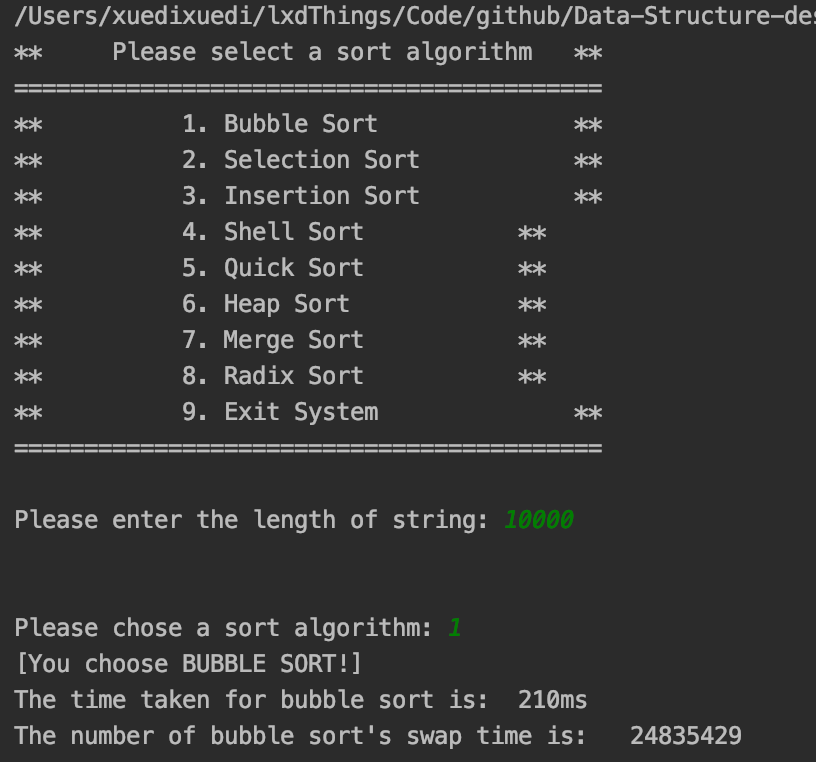
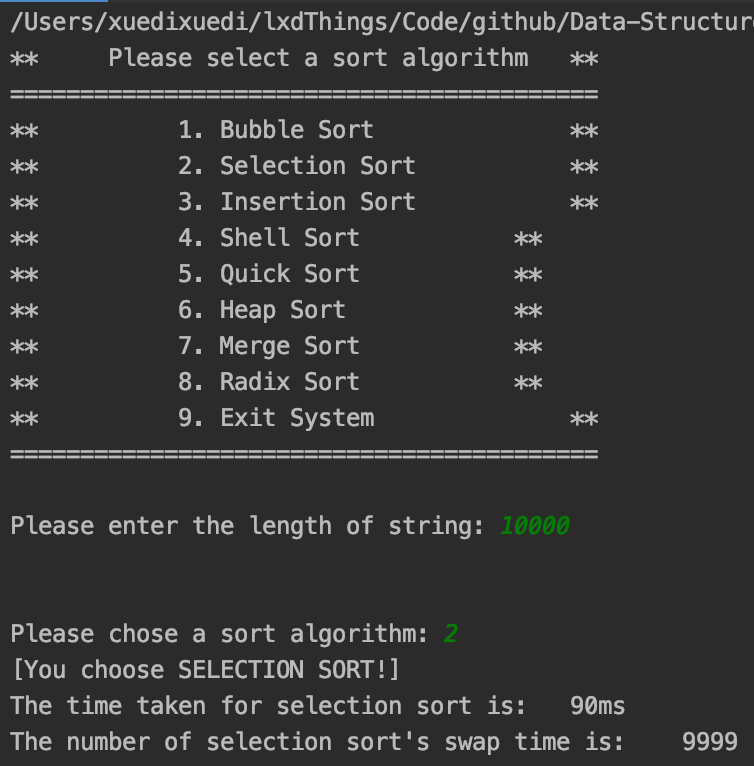
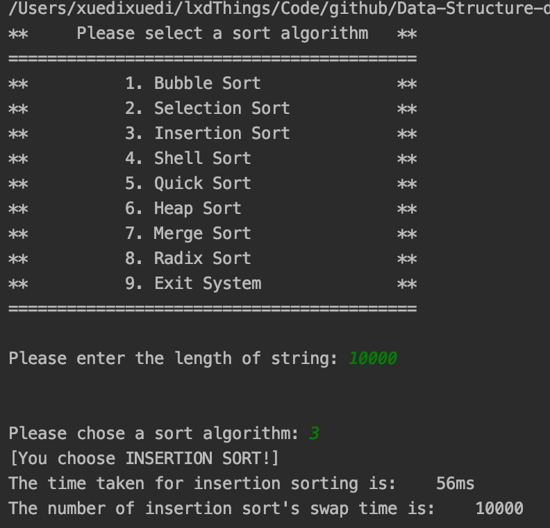
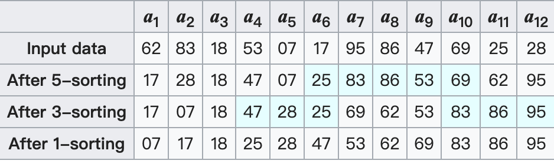
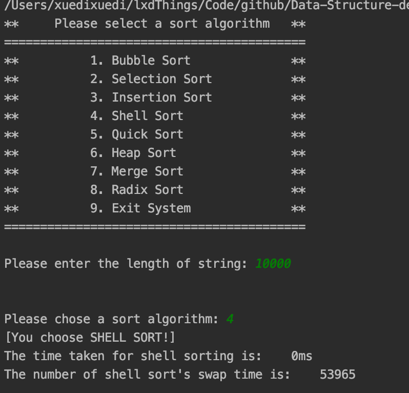
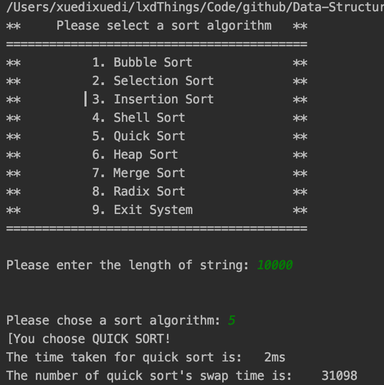
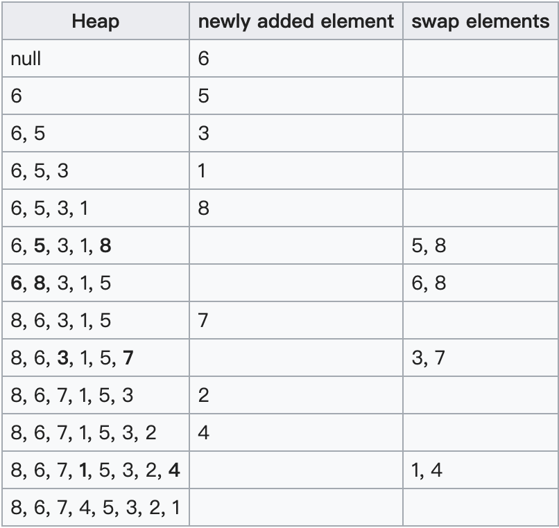
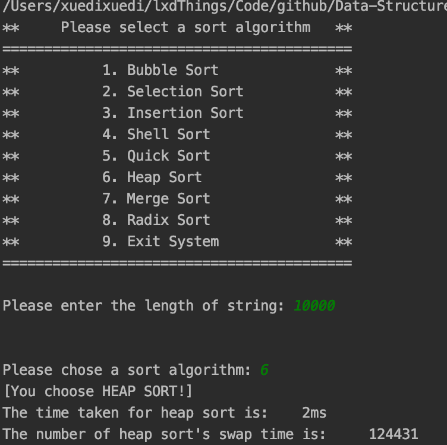
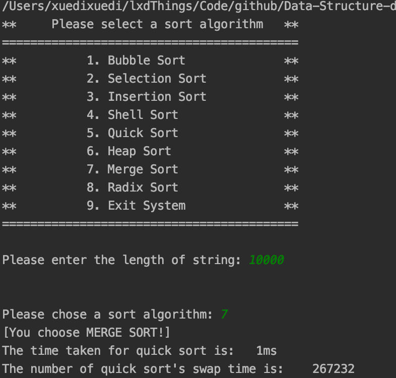
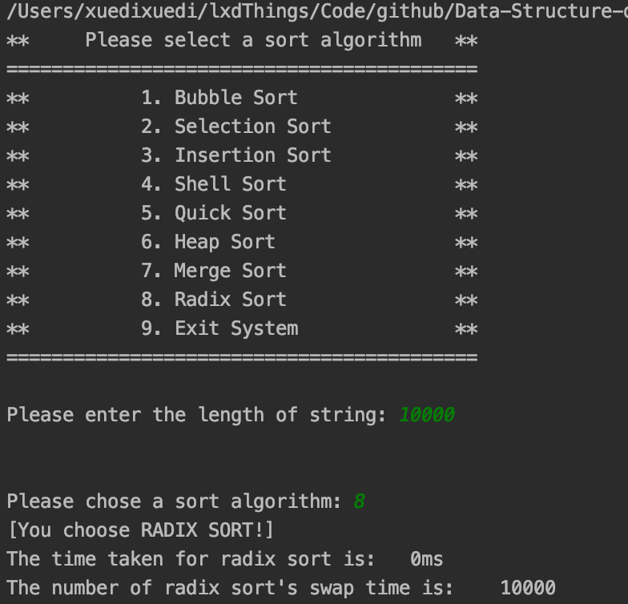

<h2 align="center">Project documentation</h2>
<h1 align="center">Data structure course design</h1>
<h2 align="right">——Comparison of eight sorting algorithms</h2>


<p align="right">
  Author name：<U>Xuedi Liu</U><br>
  Number：<U>1752985</U><br>
  instructor：<U>Ying Zhang</U><br>
  College/Major：<U>School of Software Engineering/Software Engineering</U><br>
</p>


<div STYLE="page-break-after:always;">
</div>

<div STYLE="page-break-after:always;">
</div>

[TOC]

- **Operating Environment**:
  - Unix executables: running on **Unix** platforms
  - Linux executables: running on **Linux** platforms
  - exe executable file: Windows Console Application, running on 64-bit Windows platform
- **Code hosting platform**: Github

<div STYLE="page-break-after:always;">
</div>

## 1. Bubble Sort

### 1.1 Characteristic analysis

+ **Worst and Average Case Time Complexity:** $O(n^2)$.

  *Worst case occurs when array is reverse sorted.*

+ **Best Case Time Complexity:** $O(n)$.

  Best case occurs when array is already sorted.

+ **Auxiliary Space:** $O(1)$

+ **In Place:** Yes

+ **Stable:** Yes

### 1.2 Analysis  and Example

Bubble Sort is the simplest sorting algorithm that works by repeatedly swapping the adjacent elements if they are in wrong order.

**Example:**
**First Pass:**
( **5** **1** 4 2 8 ) –> ( **1** **5** 4 2 8 ), Here, algorithm compares the first two elements, and swaps since 5 > 1.
( 1 **5** **4** 2 8 ) –> ( 1 **4** **5** 2 8 ), Swap since 5 > 4
( 1 4 **5** **2** 8 ) –> ( 1 4 **2** **5** 8 ), Swap since 5 > 2
( 1 4 2 **5** **8** ) –> ( 1 4 2 **5** **8** ), Now, since these elements are already in order (8 > 5), algorithm does not swap them.

**Second Pass:**
( **1** **4** 2 5 8 ) –> ( **1** **4** 2 5 8 )
( 1 **4** **2** 5 8 ) –> ( 1 **2** **4** 5 8 ), Swap since 4 > 2
( 1 2 **4** **5** 8 ) –> ( 1 2 **4** **5** 8 )
( 1 2 4 **5** **8** ) –> ( 1 2 4 **5** **8** )
Now, the array is already sorted, but our algorithm does not know if it is completed. The algorithm needs one **whole** pass without **any** swap to know it is sorted.

**Third Pass:**
( **1** **2** 4 5 8 ) –> ( **1** **2** 4 5 8 )
( 1 **2** **4** 5 8 ) –> ( 1 **2** **4** 5 8 )
( 1 2 **4** **5** 8 ) –> ( 1 2 **4** **5** 8 )
( 1 2 4 **5** **8** ) –> ( 1 2 4 **5** **8** )


### 1.3 Code impliment and diagram

```c++
int *bubbleSort(int *raw, int len) {
    auto result = new int[len];
    memcpy(result, raw, len * sizeof(int));
    int time;                    //Sorting time
    long long int swapTime = 0;  //Sorting times

    BEGIN_RECORD
        for (int i = len - 1; i > 0; --i) {
            for (int j = 0; j < i; ++j) {
                if (result[j] > result[j + 1]) {
                    int temp = result[j];
                    swapTime++;
                    result[j] = result[j + 1];
                    result[j + 1] = temp;
                }
            }
        }
    END_RECORD(time)

    cout << "The time taken for bubble sort is: \t" << time << "ms" << endl;
    cout << "The number of bubble sort's swap time is: \t" << swapTime << endl;
    return result;
}
```



<div STYLE="page-break-after:always;">
</div>

## 2. Selection Sort

### 2.1 Characteristic analysis

+ **Time Complexity:** $O(n^2)$

+ **Auxiliary Space:** $O(1)$

+ **Stability:** The default implementation is not stable. 

  *However it can be made stable.*

+ **In Place :** Yes

###2.2  Analysis  and Example

The selection sort algorithm sorts an array by repeatedly finding the minimum element (considering ascending order) from unsorted part and putting it at the beginning. The algorithm maintains two subarrays in a given array.

1. The subarray which is already sorted.
2. Remaining subarray which is unsorted.

In every iteration of selection sort, the minimum element (considering ascending order) from the unsorted subarray is picked and moved to the sorted subarray.

Following example explains the above steps:

```c++
arr[] = 64 25 12 22 11

// Find the minimum element in arr[0...4]
// and place it at beginning
11 25 12 22 64

// Find the minimum element in arr[1...4]
// and place it at beginning of arr[1...4]
11 12 25 22 64

// Find the minimum element in arr[2...4]
// and place it at beginning of arr[2...4]
11 12 22 25 64

// Find the minimum element in arr[3...4]
// and place it at beginning of arr[3...4]
11 12 22 25 64 
```

Flowchart for selection sort:


### 2.3 Code impliment and diagram

 

```c++
int *selectionSort(int *raw, int len) {
    auto result = new int[len];
    memcpy(result, raw, len * sizeof(int));
    int time;                    //排序用时
    long long int swapTime = 0;  //交换次数
    BEGIN_RECORD
        for (int i = 0; i < len - 1; ++i) {
            int temp = result[i];
            int k = i;
            for (int j = i; j < len; ++j) {
                if (result[j] < temp) {
                    temp = result[j];
                    k = j;
                }
            }
            result[k] = result[i];
            result[i] = temp;
            swapTime++;
        }
    END_RECORD(time)

    cout << "The time taken for selection sort is: \t" << time << "ms" << endl;
    cout << "The number of selection sort's swap time is: \t" << swapTime
         << endl;
    return result;
}
```



<div STYLE="page-break-after:always;">
</div>

## 3. Insertion Sort

### 3.1 Characteristic analysis

+ **Time Complexity:** $O(kn)$
+ **Auxiliary Space:** $O(1)$
+ **In Place:** Yes
+ **Stable:** Yes
+ **Online:** Yes

###3.2  Analysis  and Example

Insertion sort is a simple sorting algorithm that works the way we sort playing cards in our hands.

**For example:**

**12**, 11, 13, 5, 6

Let us loop for i = 1 (second element of the array) to 4 (last element of the array)

i = 1. Since 11 is smaller than 12, move 12 and insert 11 before 12
**11, 12**, 13, 5, 6

i = 2. 13 will remain at its position as all elements in A[0..I-1] are smaller than 13
**11, 12, 13**, 5, 6

i = 3. 5 will move to the beginning and all other elements from 11 to 13 will move one position ahead of their current position.
**5, 11, 12, 13**, 6

i = 4. 6 will move to position after 5, and elements from 11 to 13 will move one position ahead of their current position.
**5, 6, 11, 12, 13**


### 3.3 Code impliment and diagram

```c++
int *insertionSort(int *raw, int len) {
    auto result = new int[len];
    memcpy(result, raw, len * sizeof(int));
    int time;                    //排序用时
    long long int swapTime = 0;  //交换次数

    BEGIN_RECORD
        for (int i = 0; i < len; ++i) {
            int temp = result[i];
            int j = i - 1;
            for (; temp < result[j] && j >= 0; --j) {
                result[j + 1] = result[j];
            }
            result[j + 1] = temp;
            swapTime++;
        }
    END_RECORD(time)

    cout << "The time taken for insertion sorting is: \t" << time << "ms"
         << endl;
    cout << "The number of insertion sort's swap time is: \t" << swapTime
         << endl;
    return result;
}
```



<div STYLE="page-break-after:always;">
</div>

## 4. Shell Sort

### 4.1 Characteristic analysis

+ **Time Complexity:** depends on gap sequence

  **worst case:** $O(n^2)$ (worst known worst case gap sequence)

  ​                    $O(nlog$<sub>2</sub>$n$)(best known worst case gap sequence)

  **bast case:** $O(nlogn)$

+ **Stable:** No

###4.2  Analysis  and Example

ShellSort is mainly a variation of Insertion Sort. In insertion sort, we move elements only one position ahead. When an element has to be moved far ahead, many movements are involved. The idea of shellSort is to allow exchange of far items. In shellSort, we make the array h-sorted for a large value of h. We keep reducing the value of h until it becomes 1. An array is said to be h-sorted if all sublists of every h’th element is sorted.

An example run of Shellsort with gaps 5, 3 and 1 is shown below:



### 4.3 Code impliment and diagram

```c++
int *shellSort(int *raw, int len) {
    auto result = new int[len];
    memcpy(result, raw, len * sizeof(int));
    int time;                    //排序用时
    long long int swapTime = 0;  //交换次数

    int gap = 1;//每组的间隔
    while (gap <= len / 3) {
        gap = 3 * gap + 1;
    }

    BEGIN_RECORD
        while (gap > 0) {
            for (int i = gap; i < len; ++i) {
                if (result[i - gap] > result[i]) {
                    int temp = result[i];
                    int j = i - gap;
                    for (; result[j] > temp && j >= 0; j -= gap) {
                        result[j + gap] = temp;
                        swapTime++;
                    }
                    result[j + gap] = temp;
                    swapTime++;
                }
            }
            gap = (gap - 1) / 3;
        }
    END_RECORD(time)
    cout << "The time taken for shell sorting is: \t" << time << "ms"
         << endl;
    cout << "The number of shell sort's swap time is: \t" << swapTime
         << endl;
    return result;
}
```



<div STYLE="page-break-after:always;">
</div>

## 5. Quick Sort

### 5.1 Characteristic analysis

+ **Worst Case Time Complexity: **$\Theta(n^2)$
+ **Best Case Time Complexity:** $\Theta(n\log(n))$
+ **Average Time Complexity:** $O(n\log(n))$
+ **Stable:** No
+ **In Place: **As per the broad definition of in-place algorithm it qualifies as an in-place sorting algorithm as it uses extra space only for storing recursive function calls but not for manipulating the input.

###5.2  Analysis  and Example

QuickSort is a Divide and Conquer algorithm. It picks an element as pivot and partitions the given array around the picked pivot. There are many different versions of quickSort that pick pivot in different ways：

1. Always pick first element as pivot.
2. Always pick last element as pivot (implemented below)
3. Pick a random element as pivot.
4. Pick median as pivot.

The key process in quickSort is **partition()**. Target of partitions is, given an array and an element x of array as pivot, put $x$ at its correct position in sorted array and put all smaller elements (smaller than $x$) before $x$, and put all greater elements (greater than $x$) after $x$. All this should be done in linear time.


### 5.3 Code impliment and diagram

```c++
cout << "[You choose QUICK SORT!" << endl;
int start = 0;
int end = len - 1;
auto result = new int[len];
memcpy(result, str, len * sizeof(int));
int time;                    //排序用时
int swapTime = 0;  //交换次数
int &sw = swapTime;
BEGIN_RECORD
    quickSort(result, start, end, sw);
END_RECORD(time);
cout << "The time taken for quick sort is: \t" << time << "ms" << endl;
cout << "The number of quick sort's swap time is: \t" << swapTime << endl;
break;
```

```c++
int *quickSort(int *raw, int start, int end, int &swapTime) {
    if (start < end) {
        int i = start;
        int j = end;
        int temp = raw[start];
        while (i < j) {
            while (i < j && raw[j] >= temp) {
                j--;
            }
            if (i < j) {
                raw[i] = raw[j];
                swapTime++;
            }
            while (i < j && raw[i] < temp) {
                i++;
            }
            if (i < j) {
                raw[j] = raw[i];
                swapTime++;
            }
        }
        raw[i] = temp;
        quickSort(raw, i + 1, end, swapTime);
        quickSort(raw, start, i - 1, swapTime);
    }
    return raw;
}
```



<div STYLE="page-break-after:always;">
</div>

## 6. Heap Sort

### 6.1 Characteristic analysis

**Time Complexity:**$O(logn)$

**Stable:** No

**In Place: **Yes

###6.2  Analysis  and Example

Heap sort is a comparison based sorting technique based on Binary Heap data structure. It is similar to selection sort where we first find the maximum element and place the maximum element at the end. We repeat the same process for remaining element.

First define a Complete Binary Tree. A complete binary tree is a binary tree in which every level, except possibly the last, is completely filled, and all nodes are as far left as possible.

A Binary Heap is a Complete Binary Tree where items are stored in a special order such that value in a parent node is greater(or smaller) than the values in its two children nodes. The former is called as max heap and the latter is called min heap. The heap can be represented by binary tree or array.

**Heap Sort Algorithm for sorting in increasing order:**

1. Build a max heap from the input data.
2. At this point, the largest item is stored at the root of the heap. Replace it with the last item of the heap followed by reducing the size of heap by 1. Finally, heapify the root of tree.
3. Repeat above steps while size of heap is greater than 1.



### 6.3 Code impliment and diagram

```c++
int *adjustHeap(int *heap, int start, int end, int &swapTime) {
    int temp = heap[start];
    for (int i = 2 * start + 1; i <= end; i = i * 2 + 1) {
        if (heap[i] < heap[i + 1] && i + 1 <= end) {
            i++;
        }
        if (heap[i] < temp) {
            break;
        }
        heap[start] = heap[i];
        start = i;
        swapTime++;
    }
    heap[start] = temp;

}
```

```c++
int *heapSort(int *raw, int len) {
    auto result = new int[len];
    memcpy(result, raw, len * sizeof(int));
    int time;                    //排序用时
    int swapTime = 0;  //交换次数
    int &sw = swapTime;
    BEGIN_RECORD
        for (int i = (len - 1) / 2; i >= 0; --i) {
            adjustHeap(result, i, len - 1, sw);
        }
        for (int i = len - 1; i >= 0; --i) {
            int temp = result[i];
            result[i] = result[0];
            result[0] = temp;
            swapTime++;
            adjustHeap(result, 0, i - 1, sw);
        }
    END_RECORD(time)
    cout << "The time taken for heap sort is: \t" << time << "ms" << endl;
    cout << "The number of heap sort's swap time is: \t" << swapTime << endl;
    return result;
}
```



<div STYLE="page-break-after:always;">
</div>

## 7. Merge Sort

### 7.1 Characteristic analysis

+ **Time Complexity:** $O(n\log(n))$
+ **Auxiliary Space:** $O(n)$
+ **In Place:** No
+ **Stable:** Yes
+ **Algorithmic Paradigm:** Divide and Conquer

###7.2  Analysis  and Example

Merge Sort is a Divide and Conquer algorithm. It divides input array in two halves, calls itself for the two halves and then merges the two sorted halves. **The merge() function** is used for merging two halves. The merge(arr, l, m, r) is key process that assumes that arr[l..m] and arr[m+1..r] are sorted and merges the two sorted sub-arrays into one. See following C implementation for details.

The following diagram from wikipedia shows the complete merge sort process for an example array {38, 27, 43, 3, 9, 82, 10}. If we take a closer look at the diagram, we can see that the array is recursively divided in two halves till the size becomes 1. Once the size becomes 1, the merge processes comes into action and starts merging arrays back till the complete array is merged.


### 7.3 Code impliment and diagram

```c++
cout << "[You choose MERGE SORT!]" << endl;
                int start = 0;
                int end = len - 1;
                auto result = new int[len];
                auto buffer = new int[len];
                memcpy(result, str, len * sizeof(int));
                int time;
                int swapTime = 0;  //交换次数
                int &sw = swapTime;
                BEGIN_RECORD
                    mergeSort(result, start, end, buffer, sw);
                END_RECORD(time);
                cout << "The time taken for quick sort is: \t" << time << "ms" << endl;
                cout << "The number of quick sort's swap time is: \t" << swapTime << endl;
                break;
```

```c++
int *merge(int *input, int start, int mid, int end, int *output, int &swapTime) {
    int first = start;//第一个待合并待起点
    int second = mid + 1;//第二个待合并待起点
    int out = start;//合并结果待起点
    while (first <= mid && second <= end) {
        if (input[first] < input[second]) {
            output[out++] = input[first++];
            swapTime++;
        } else {
            output[out++] = input[second++];
            swapTime++;
        }
    }
    while (first <= mid) {
        output[out++] = input[first++];
        swapTime++;
    }
    while (second <= end) {
        output[out++] = input[second++];
        swapTime++;
    }
    for (int i = start; i <= end; i++) {
        input[i] = output[i];
        swapTime++;
    }
}
```

```c++
int *mergeSort(int *raw, int start, int end, int *buffer, int &swapTime) {
    if (start < end) {
        int mid = (start + end) / 2;
        mergeSort(raw, start, mid, buffer, swapTime);
        mergeSort(raw, mid + 1, end, buffer, swapTime);
        merge(raw, start, mid, end, buffer, swapTime);
    }
    return raw;
}
```



<div STYLE="page-break-after:always;">
</div>

## 8. Raidx Sort

### 8.1 Characteristic analysis

+ **Time complexity: **$O(d*(n+b))$

  *b is the base for representing numbers*

  *if k is the maximum possible value, then d would be O(logb(k))*

###8.2  Analysis  and Example

Radix sort is a non-comparative sorting algorithm. It avoids comparison by creating and distributing elements into buckets according to their radix. For elements with more than one significant digit, this bucketing process is repeated for each digit, while preserving the ordering of the prior step, until all digits have been considered. For this reason, **radix sort** has also been called **bucket sort** and **digital sort**.


### 8.3 Code impliment and diagram

```c++
int countSort(int *raw, int len, int bit) {
    auto output = new int[len];
    int swapTime = 0;
    int i, buckets[10] = {0};

    //将数据出现的次数储存在bucket
    for (i = 0; i < len; ++i) {
        buckets[(raw[i] / bit) % 10]++;
        swapTime++;
    }
    //更改buckets[i]目的是让更改后的buckets[i]的值 是该数据在output[]中的位置
    for (i = 1; i < 10; i++) {
        buckets[i] += buckets[i - 1];
    }

    // 将数据存储到临时数组output[]中
    for (i = len - 1; i >= 0; i--) {
        output[buckets[(raw[i] / bit) % 10] - 1] = raw[i];
        buckets[(raw[i] / bit) % 10]--;
    }
    // 将排序好的数据赋值给a[]
    for (i = 0; i < len; i++) {
        raw[i] = output[i];
    }
    return swapTime;
}
```

```c++
int *radixSort(int *raw, int len) {
    int maxNum = max(raw, len);
    int bit, time, swapTime = 0;
    BEGIN_RECORD
        for (bit = 1; maxNum / bit > 0; bit = bit * 10) {
            swapTime = countSort(raw, len, bit);
        }
    END_RECORD(time)
    cout << "The time taken for radix sort is: \t" << time << "ms" << endl;
    cout << "The number of radix sort's swap time is: \t" << swapTime << endl;

}
```

